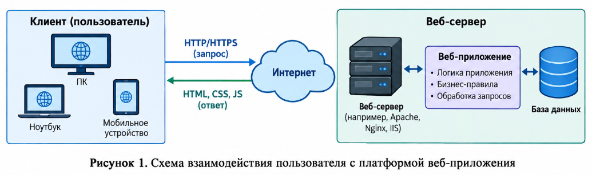
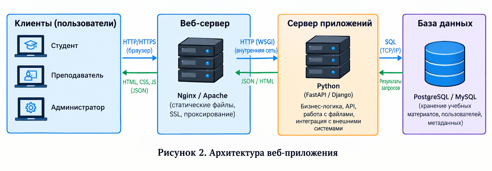

# Learning-Materials-Management-Software
# 1 Общие сведения

1.  **Основание для выполнения работ**

  Программа цифровизации образовательного процесса в ФГБОУ ВО «ВолгГТУ».

# 1.2 Заказчик работ

Заказчик: ФГБОУ ВО «ВолгГТУ».

# 1.3 Сведения об источниках и порядке финансирования

Источник финансирования определяется Заказчиком.

# 1.4 Цель выполнения работ

Целью выполнения работ является разработка программного продукта — веб-приложения для управления учебными материалами, предназначенного для централизованного хранения, структурирования и предоставления доступа к учебным ресурсам.

# 1.5 Состав работ

По настоящему Договору Исполнитель выполняет перечисленные ниже работы:

1.  Разработка веб-приложения для управления учебными материалами;

2.  Разработка программного интерфейса приложений для интеграции с внешними информационными системами;

3.  Развертывание веб-приложения на инфраструктуре Заказчика;

4.  Разработка дизайна мобильных приложений;

5.  Разработка технического задания на разработку мобильных приложений.

# 1.6 Сроки выполнения работ

<table>
<colgroup>
<col style="width: 13%" />
<col style="width: 31%" />
<col style="width: 27%" />
<col style="width: 28%" />
</colgroup>
<thead>
<tr class="header">
<th>№ этапа</th>
<th>Наименование этапа</th>
<th>Срок сдачи работ</th>
<th>Результат работ</th>
</tr>
</thead>
<tbody>
<tr class="odd">
<td>1</td>
<td>Разработка веб-приложения и программного интерфейса для интеграции</td>
<td>Не более 45 дней, точный срок определяется при заключении договора</td>
<td>—Техническое задание на разработку мобильных приложений; 
— Веб-приложение для управления учебными материалами; 
— Комплект документов технического проекта; 
— Комплект эксплуатационной документации; 
— Программа и методика испытаний; 
— Протокол проведения предварительных испытаний; 
— Исходные коды веб-приложения.</td>
</tr>
<tr class="even">
<td>2</td>
<td>Проведение опытной эксплуатации веб-приложения</td>
<td>Не более 25 дней, точный срок определяется при заключении договора</td>
<td>— Отчет о проведении опытной эксплуатации; 
— Протокол проведения приемо-сдаточных испытаний.</td>
</tr>
</tbody>
</table>

# 1.7 Место выполнения работ

Работы выполняются на территории Российской федерации.

# 2 Назначение веб-приложения для управления учебными материалами

Веб-приложение для управления учебными материалами должно представлять собой единый ресурс для централизованного хранения, систематизации и предоставления доступа к учебно-методическим материалам. На базе веб-приложения ФГБОУ ВО «ВолгГТУ» будет организована работа с учебными материалами.

Пользователи (преподаватели и обучающиеся) должны иметь доступ к информации об опубликованных учебных ресурсах, возможность просмотра, поиска и скачивания материалов, а также управления ими (для преподавателей) посредством веб-интерфейса и в приложениях для мобильных устройств.

# 3 Описание работы веб-приложения

# 3.1 Схема взаимодействия пользователей с платформой

Веб-приложение представляет собой единый ресурс для управления учебными материалами, предназначенный для автоматизации процессов публикации, хранения, поиска и предоставления доступа к учебным ресурсам. Взаимодействие с платформой строится на основе ролевой модели, включающей три категории пользователей: Студент, Преподаватель и Администратор.

Пользователи получают доступ к функциям системы после прохождения процедуры аутентификации. Администратор имеет полный доступ ко всем функциям системы: управление пользователями (создание, блокировка, удаление, изменение ролей), управление структурой дисциплин и категорий материалов, просмотр системного журнала событий.

Преподаватель после авторизации получает доступ к панели управления материалами. Преподаватель может загружать новые учебные материалы в поддерживаемых форматах (PDF, DOCX, PPTX), структурировать их по дисциплинам и темам, редактировать метаданные материалов и удалять устаревшие материалы.

Студент после входа в систему получает доступ к каталогу учебных материалов, где может осуществлять просмотр, поиск и фильтрацию материалов по различным критериям, скачивать файлы, добавлять материалы в избранное и оставлять комментарии.

**Рисунок 1. Схема взаимодействия пользователей с платформой веб-приложения**

# 3.2 Архитектура веб-приложения

Архитектура веб-приложения строится по принципу клиент-сервер с выделением следующих компонентов:

- Клиентская часть (Frontend) — пользовательский интерфейс, реализованный с использованием современных веб-технологий и адаптированный для работы на персональных компьютерах и мобильных устройствах;

- Серверная часть (Backend) — обеспечивает обработку запросов, бизнес-логику и взаимодействие с базой данных;

- База данных — хранит информацию о пользователях, материалах, комментариях и системных настройках;

- Система хранения файлов — предназначена для хранения загружаемых учебных материалов.

Компоненты системы должны быть развернуты на серверной инфраструктуре Заказчика и обеспечивать возможность масштабирования при росте нагрузки.

**Рисунок 2. Архитектура веб-приложения**

# 3.3 Сценарии использования веб-приложения

# 3.3.1 Регистрация и авторизация пользователя

| Действующие лица:                 | Студент, Преподаватель, Администратор                                                                                                                                                                                                                                                                                                                                                                                                                   |
|-----------------------------------|---------------------------------------------------------------------------------------------------------------------------------------------------------------------------------------------------------------------------------------------------------------------------------------------------------------------------------------------------------------------------------------------------------------------------------------------------------|
| **Объекты взаимодействия:**       | Веб-приложение, База данных                                                                                                                                                                                                                                                                                                                                                                                                                             |
| **Предусловия:**                  | У пользователя есть доступ к сети Интернет                                                                                                                                                                                                                                                                                                                                                                                                              |
| **Инициируется:**                 | Пользователем                                                                                                                                                                                                                                                                                                                                                                                                                                           |
| **Нефункциональные требования:**  | Время отклика системы не более 3 секунд                                                                                                                                                                                                                                                                                                                                                                                                                 |
| **Основные шаги сценария:**       | 1\) Пользователь открывает веб-приложение; 2) Переходит на страницу авторизации; 3) Вводит логин и пароль; 4) Система проверяет учетные данные; 5) При успешной проверке пользователь перенаправляется на главную страницу с доступом к материалам согласно его роли; 6) При неуспешной проверке пользователь получает сообщение об ошибке; 7) Восстановление пароля осуществляется через форму восстановления с отправкой ссылки на электронную почту. |
| **Расширение сценария:**          | —                                                                                                                                                                                                                                                                                                                                                                                                                                                       |
| **Принципы учета и тарификации:** | Не тарифицируется                                                                                                                                                                                                                                                                                                                                                                                                                                       |

# 3.3.2 Загрузка учебного материала преподавателем

| Действующие лица:                 | Преподаватель                                                                                                                                                                                                                                                                                                                                                                                                                |
|-----------------------------------|------------------------------------------------------------------------------------------------------------------------------------------------------------------------------------------------------------------------------------------------------------------------------------------------------------------------------------------------------------------------------------------------------------------------------|
| **Объекты взаимодействия:**       | Веб-приложение, База данных, Система хранения файлов                                                                                                                                                                                                                                                                                                                                                                         |
| **Предусловия:**                  | Преподаватель авторизован в системе                                                                                                                                                                                                                                                                                                                                                                                          |
| **Инициируется:**                 | Преподавателем                                                                                                                                                                                                                                                                                                                                                                                                               |
| **Нефункциональные требования:**  | Поддерживаемые форматы файлов: PDF, DOCX, PPTX, XLSX, JPG, PNG. Максимальный размер файла — 20 МБ                                                                                                                                                                                                                                                                                                                            |
| **Основные шаги сценария:**       | 1\) Преподаватель переходит в раздел «Управление материалами»; 2) Нажимает кнопку «Добавить материал»; 3) Заполняет метаданные: название, описание, выбирает дисциплину и тему; 4) Прикрепляет файл; 5) Нажимает кнопку «Опубликовать»; 6) Система проверяет корректность введенных данных и тип файла; 7) Система сохраняет материал в базу данных и загружает файл в хранилище; 8) Материал становится доступен студентам. |
| **Расширение сценария:**          | 6.1) Если файл не соответствует допустимому формату или превышает максимальный размер, система выводит сообщение об ошибке; 6.2) Если не заполнены обязательные поля, система выводит сообщение о необходимости их заполнения.                                                                                                                                                                                               |
| **Принципы учета и тарификации:** | Не тарифицируется                                                                                                                                                                                                                                                                                                                                                                                                            |

# 3.3.3 Просмотр и поиск материалов студентом

| Действующие лица:                 | Студент                                                                                                                                                                                                                                                                                                                                                                                                                  |
|-----------------------------------|--------------------------------------------------------------------------------------------------------------------------------------------------------------------------------------------------------------------------------------------------------------------------------------------------------------------------------------------------------------------------------------------------------------------------|
| **Объекты взаимодействия:**       | Веб-приложение, База данных                                                                                                                                                                                                                                                                                                                                                                                              |
| **Предусловия:**                  | Студент авторизован в системе                                                                                                                                                                                                                                                                                                                                                                                            |
| **Инициируется:**                 | Студентом                                                                                                                                                                                                                                                                                                                                                                                                                |
| **Нефункциональные требования:**  | Поиск должен выполняться с учетом морфологии русского языка                                                                                                                                                                                                                                                                                                                                                              |
| **Основные шаги сценария:**       | 1\) Студент переходит на главную страницу; 2) Видит список доступных материалов; 3) Использует поисковую строку для поиска по названию и описанию; 4) Использует фильтры по дисциплине, типу файла и дате загрузки; 5) Нажимает на название материала для просмотра его описания; 6) Нажимает кнопку «Скачать» для загрузки файла; 7) Нажимает кнопку «Добавить в избранное» для сохранения материала в личном кабинете. |
| **Расширение сценария:**          | —                                                                                                                                                                                                                                                                                                                                                                                                                        |
| **Принципы учета и тарификации:** | Не тарифицируется                                                                                                                                                                                                                                                                                                                                                                                                        |

# 3.3.4 Добавление ответа студентом

| Действующие лица:                 | Студент                                                                                                                                                                                                                                                                                       |
|-----------------------------------|-----------------------------------------------------------------------------------------------------------------------------------------------------------------------------------------------------------------------------------------------------------------------------------------------|
| **Объекты взаимодействия:**       | Веб-приложение, База данных, Система хранения файлов                                                                                                                                                                                                                                          |
| **Предусловия:**                  | Студент авторизован в системе, материал опубликован и доступен                                                                                                                                                                                                                                |
| **Инициируется:**                 | Студентом                                                                                                                                                                                                                                                                                     |
| **Нефункциональные требования:**  | Поддерживаемые форматы файлов ответа: PDF, DOCX, PPTX, XLSX, JPG, PNG. Максимальный размер файла — 20 МБ                                                                                                                                                                                      |
| **Основные шаги сценария:**       | 1\) Студент открывает страницу просмотра материала; 2) Нажимает кнопку «Добавить ответ»; 3) Вводит текст ответа и/или прикрепляет файл; 4) Нажимает кнопку «Отправить»; 5) Система сохраняет ответ и отображает его на странице материала.                                                    |
| **Расширение сценария:**          | 4.1) Если текст ответа не введен и файл не прикреплен, система выводит сообщение о необходимости заполнения текстового поля или прикрепления файла; 4.2) Если прикрепленный файл не соответствует допустимому формату или превышает максимальный размер, система выводит сообщение об ошибке. |
| **Принципы учета и тарификации:** | Не тарифицируется                                                                                                                                                                                                                                                                             |

# 3.3.5 Управление пользователями администратором

| Действующие лица:                 | Администратор                                                                                                                                                                                                                                                                                                 |
|-----------------------------------|---------------------------------------------------------------------------------------------------------------------------------------------------------------------------------------------------------------------------------------------------------------------------------------------------------------|
| **Объекты взаимодействия:**       | Веб-приложение, База данных                                                                                                                                                                                                                                                                                   |
| **Предусловия:**                  | Администратор авторизован в системе                                                                                                                                                                                                                                                                           |
| **Инициируется:**                 | Администратором                                                                                                                                                                                                                                                                                               |
| **Нефункциональные требования:**  | Действия администратора должны логироваться в системный журнал                                                                                                                                                                                                                                                |
| **Основные шаги сценария:**       | 1\) Администратор переходит в раздел «Пользователи»; 2) Просматривает список всех зарегистрированных пользователей с указанием их ролей и статусов; 3) Выбирает пользователя и выполняет одно из действий: — блокировка/разблокировка учетной записи; — изменение роли пользователя; — удаление пользователя. |
| **Расширение сценария:**          | —                                                                                                                                                                                                                                                                                                             |
| **Принципы учета и тарификации:** | Не тарифицируется                                                                                                                                                                                                                                                                                             |

# 4 Требования к системе

# 4.1 Функциональные требования

Веб-приложение должно предоставлять Пользователям следующие возможности:

- регистрация и аутентификация пользователей;

- просмотр каталога учебных материалов;

- поиск и фильтрация материалов по различным критериям;

- скачивание файлов учебных материалов;

- добавление материалов в избранное;

- комментирование материалов;

- загрузка новых учебных материалов (для преподавателей);

- редактирование и удаление учебных материалов (для преподавателей);

- управление пользователями и их ролями (для администратора);

- просмотр системного журнала событий (для администратора).

Для выполнения возложенных функций веб-приложение должно включать в себя следующие функциональные подсистемы:

1.  Подсистема аутентификации и авторизации пользователей;

2.  Подсистема управления учебными материалами;

3.  Подсистема поиска и фильтрации;

4.  Подсистема комментирования;

5.  Подсистема управления пользователями;

6.  Подсистема хранения и управления файлами;

7.  Подсистема логирования действий пользователей.

# 4.1.1 Аутентификация и авторизация пользователей

Процесс аутентификации пользователей выполняется по логину и паролю. Пароль должен храниться в базе данных в зашифрованном виде с использованием алгоритмов хеширования. Восстановление пароля осуществляется через форму восстановления с отправкой ссылки на электронную почту пользователя.

Должна быть реализована ролевая модель доступа с тремя ролями:

- **Студент** — доступ к просмотру, поиску, скачиванию материалов, комментированию и добавлению в избранное;

- **Преподаватель** — доступ к управлению материалами (добавление, редактирование, удаление);

- **Администратор** — полный доступ ко всем функциям системы.

# 4.1.2 Управление учебными материалами

В системе должны быть реализованы следующие функции:

- создание материала с указанием названия, описания, дисциплины, темы и прикреплением файла;

- редактирование метаданных материала;

- удаление материала;

- просмотр списка материалов с возможностью сортировки и фильтрации;

- скачивание прикрепленных файлов.

Поддерживаемые форматы файлов: PDF, DOCX, PPTX, XLSX, JPG, PNG. Максимальный размер файла — 20 МБ.

# 4.1.3 Поиск и фильтрация

Система должна обеспечивать:

- полнотекстовый поиск по названиям и описаниям материалов;

- фильтрацию материалов по дисциплине;

- фильтрацию по типу файла;

- фильтрацию по дате загрузки;

- сортировку результатов по дате (новые/старые), по названию (А-Я).

# 4.1.4 Комментирование

Должна быть реализована возможность оставления комментариев к материалам авторизованными пользователями с ролью Студент. Комментарии должны содержать:

- текст комментария;

- дату и время добавления;

- имя пользователя, оставившего комментарий.

# 4.1.5 Управление пользователями

Администратор должен иметь возможность:

- просматривать список всех зарегистрированных пользователей;

- изменять роли пользователей;

- блокировать и разблокировать учетные записи;

- удалять пользователей.

# 4.1.6 Системное логирование

Система должна вести журнал действий пользователей с фиксацией следующих событий:

- вход и выход пользователей из системы;

- добавление, редактирование и удаление материалов;

- загрузка файлов;

- изменения в учетных записях пользователей.

# 4.2 Нефункциональные требования

# 4.2.1 Требования к надежности

Веб-приложение должно сохранять работоспособность при штатных нагрузках. Должна быть реализована обработка ошибок ввода/вывода данных. В случае сбоя система не должна терять данные и должна корректно завершать текущие операции.

При возникновении следующих аварийных ситуаций система должна автоматически восстанавливать свою работоспособность:

- при сбоях в электроснабжении аппаратной части (восстановление происходит после перезапуска ОС);

- при ошибках в работе аппаратных средств (восстановление функций возлагается на ОС);

- при ошибках, связанных с программным обеспечением (восстановление работоспособности возлагается на ОС).

Должно быть обеспечено резервное копирование базы данных и файлов материалов с периодичностью, определяемой администратором системы.

# 4.2.2 Условия эксплуатации

Устанавливаются следующие общие требования к условиям эксплуатации и техническому обслуживанию:

- Эксплуатация и техническое обслуживание средств должно осуществляться системным администратором;

- Системный администратор должен обладать навыками по установке, настройке и администрированию программных и технических средств, а также иметь высокий уровень квалификации в области администрирования операционных систем и систем управления базами данных, разработки и реализации политики информационной безопасности;

- Пользователи системы должны иметь опыт работы с персональным компьютером на уровне квалифицированного пользователя;

- Размещение технических средств должно быть выполнено в соответствии с требованиями санитарных норм и правил;

- Условия эксплуатации, а также виды и периодичность обслуживания технических средств должны соответствовать требованиям по эксплуатации, изложенным в документации производителя.

Обязательной составляющей регламентных работ технического обслуживания должно быть периодическое резервное копирование информационных ресурсов, в том числе базы данных и файлов учебных материалов.

# 4.2.3 Требования к информационной и программной совместимости

Информационное взаимодействие между компонентами системы осуществляется через общую базу данных. Интерфейсы системы должны быть построены на основе открытых стандартов.

Работоспособность веб-приложения должна обеспечиваться в следующих интернет-обозревателях:

- Google Chrome версии 90 и выше;

- Mozilla Firefox версии 88 и выше;

- Microsoft Edge версии 90 и выше;

- Яндекс.Браузер версии 21 и выше;

- Safari версии 14 и выше.

Веб-приложение должно обеспечивать комфортную работу при удаленном доступе в сетях передачи данных со скоростью не менее 512 Кбит/сек.

Верстка и функциональность интерфейса должны корректно отображаться на экранах с разрешением от 320 пикселей по ширине (адаптивный дизайн).

# 4.2.4 Требования к составу и параметрам технических средств

Развертывание веб-приложения должно производиться на серверной инфраструктуре Заказчика. Технические характеристики серверного оборудования должны обеспечивать стабильную работу системы при одновременном доступе до 100 пользователей.

Минимальные требования к серверному оборудованию:

| **Компонент**         | **Требование**                    |
|-----------------------|-----------------------------------|
| Процессор             | 4 ядра, 2.0 ГГц                   |
| Оперативная память    | 8 ГБ                              |
| Дисковое пространство | 100 ГБ (для базы данных и файлов) |
| Операционная система  | Linux (Ubuntu 20.04 LTS или выше) |

Рабочая станция системного администратора должна соответствовать минимальным требованиям:

| **Компонент**         | **Требование**                |
|-----------------------|-------------------------------|
| Процессор             | Intel Core i3 или аналогичный |
| Оперативная память    | 4 ГБ                          |
| Дисковое пространство | 80 ГБ                         |
| Монитор               | 1280x1024                     |
