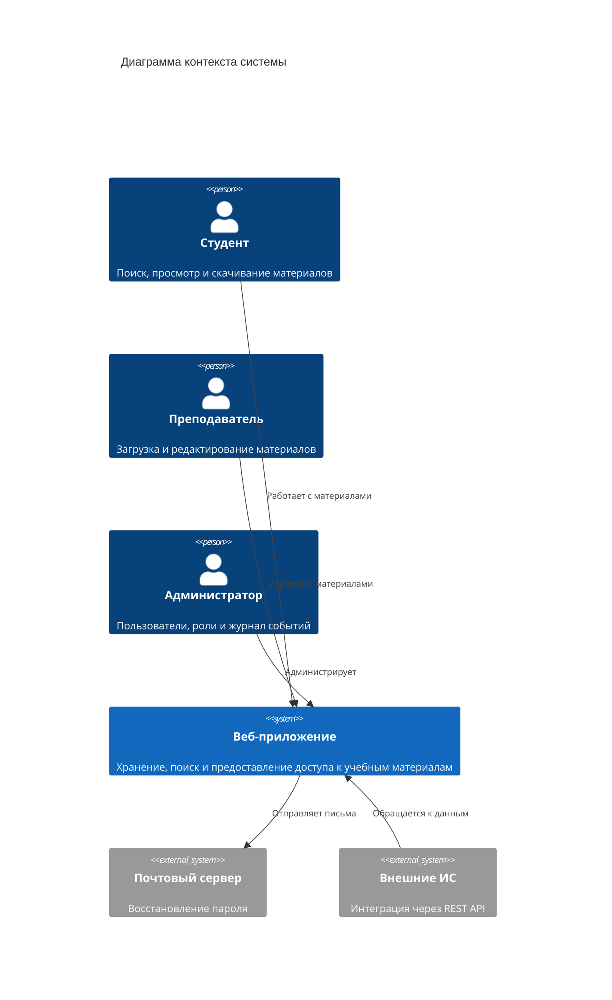
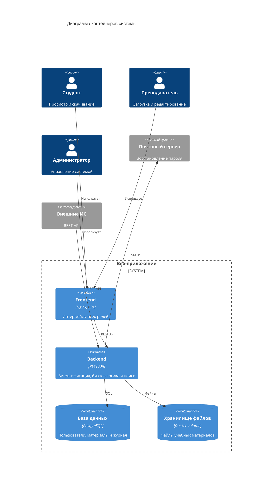
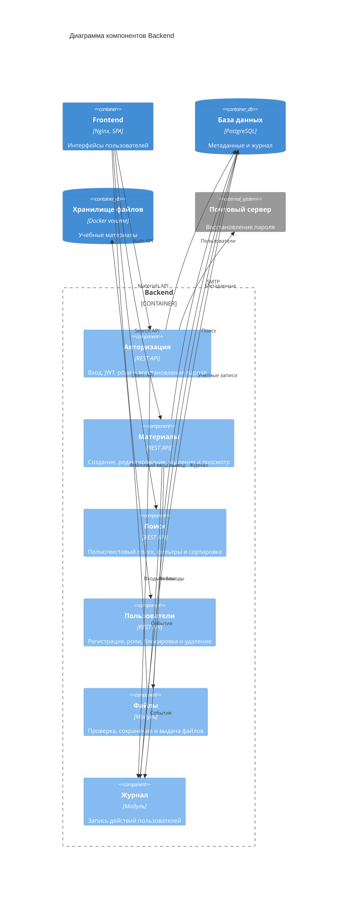
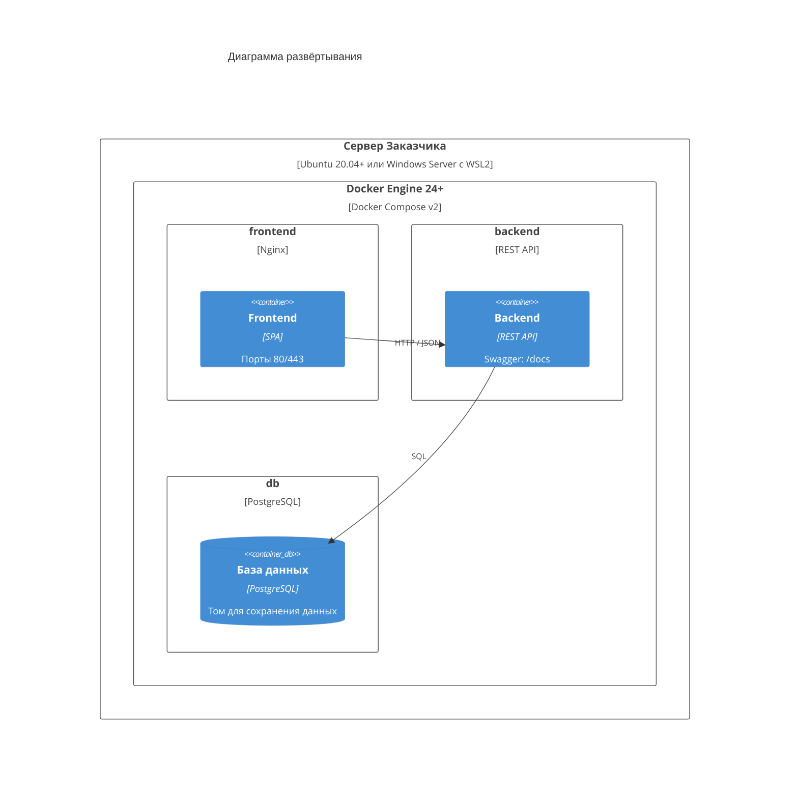

# Архитектура веб-приложения для управления учебными материалами (C4)

## Уровень 1. Контекст системы

## Уровень 2. Контейнеры

## Уровень 3. Компоненты серверной части

## Развёртывание

> Развёртывание выполняется в двух экземплярах: тестовая и промышленная среды.
