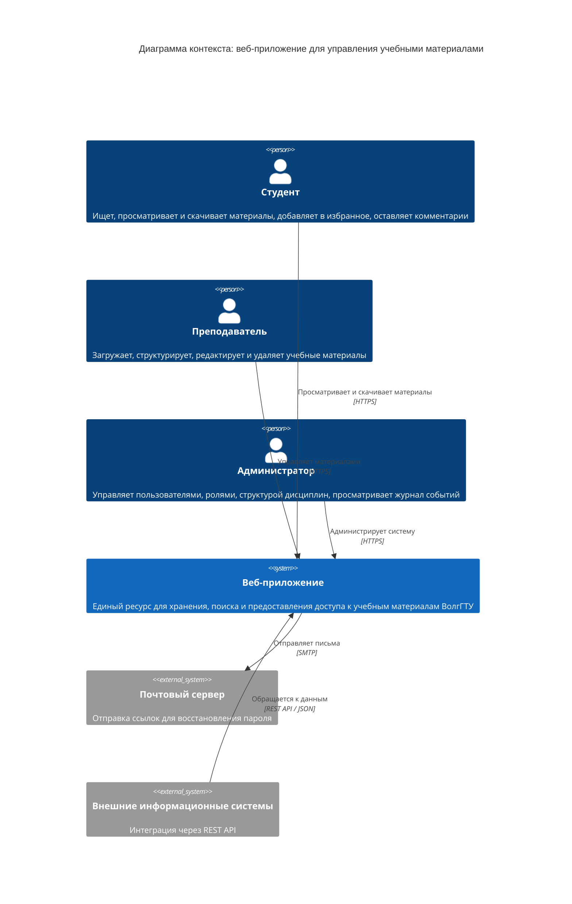
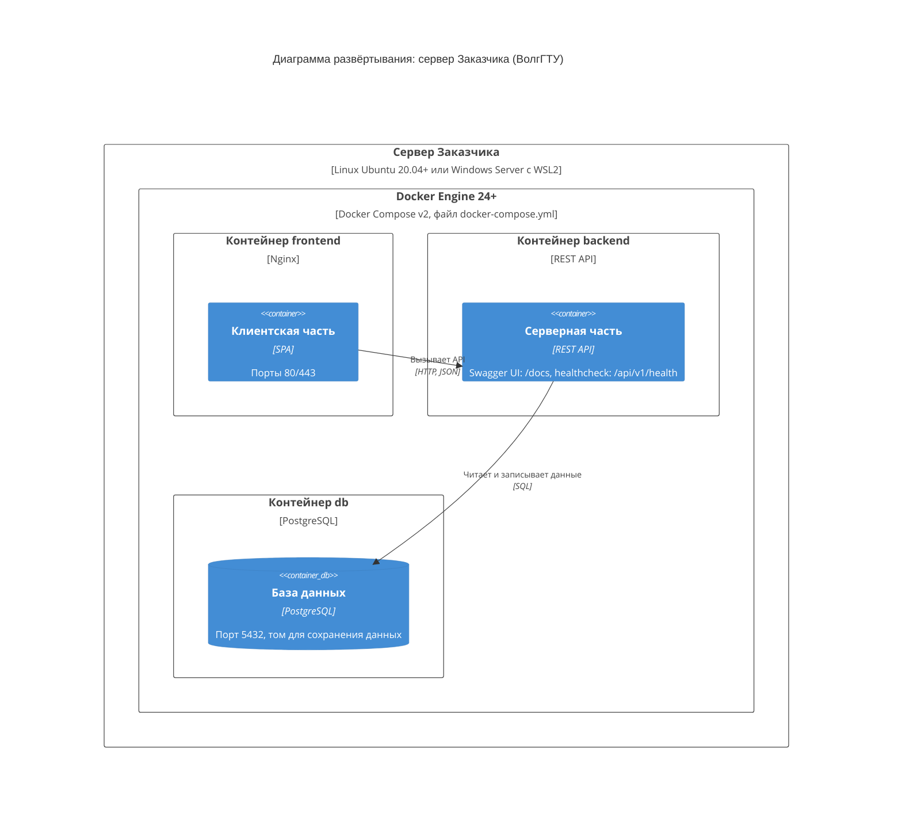

# Архитектура веб-приложения для управления учебными материалами (C4)

## Уровень 1. Контекст системы

Кто и как взаимодействует с веб-приложением (см. раздел 3.1 ТЗ).



## Уровень 2. Контейнеры

Из каких частей состоит веб-приложение (см. раздел 3.2 ТЗ).

```mermaid
C4Container
    title Диаграмма контейнеров: веб-приложение для управления учебными материалами

    Person(student, "Студент", "Просмотр, поиск, скачивание материалов")
    Person(teacher, "Преподаватель", "Загрузка и редактирование материалов")
    Person(admin, "Администратор", "Управление пользователями, журнал событий")

    System_Boundary(webapp, "Веб-приложение") {
        Container(frontend, "Клиентская часть (Frontend)", "Nginx, SPA", "Интерфейсы студента, преподавателя и администратора, адаптивная вёрстка от 320 px")
        Container(backend, "Серверная часть (Backend)", "REST API", "Аутентификация, ролевая модель, бизнес-логика, поиск и фильтрация, журналирование")
        ContainerDb(db, "База данных", "PostgreSQL", "Пользователи, материалы, дисциплины, избранное, комментарии, журнал событий")
        ContainerDb(files, "Хранилище файлов", "Том Docker / файловая система", "Загруженные файлы: PDF, DOCX, PPTX, XLSX, JPG, PNG, до 20 МБ")
    }

    System_Ext(mail, "Почтовый сервер", "Восстановление пароля")
    System_Ext(external, "Внешние информационные системы", "Интеграция через API")

    Rel_D(student, frontend, "Использует", "HTTPS")
    Rel_D(teacher, frontend, "Использует", "HTTPS")
    Rel_D(admin, frontend, "Использует", "HTTPS")

    Rel_D(frontend, backend, "Вызывает API", "HTTPS, JSON, /api/v1")
    Rel_DL(backend, db, "Читает и записывает данные", "SQL, порт 5432")
    Rel_DR(backend, files, "Сохраняет и отдаёт файлы", "Файловый ввод-вывод")
    Rel_R(backend, mail, "Отправляет ссылки восстановления пароля", "SMTP")
    Rel_L(external, backend, "Интеграция", "REST API")
```

## Уровень 3. Компоненты серверной части

Из каких модулей состоит Backend (функциональные подсистемы из раздела 4.1 ТЗ).

```mermaid
C4Component
    title Диаграмма компонентов: серверная часть (Backend)

    Container(frontend, "Клиентская часть (Frontend)", "Nginx, SPA", "Интерфейсы трёх ролей")
    ContainerDb(db, "База данных", "PostgreSQL", "Пользователи, материалы, журнал событий")
    ContainerDb(files, "Хранилище файлов", "Том Docker", "Файлы учебных материалов")
    System_Ext(mail, "Почтовый сервер", "Восстановление пароля")

    Container_Boundary(backend, "Серверная часть (Backend)") {
        Component(auth, "Идентификация и авторизация", "REST API", "Вход по логину и паролю, хеширование паролей, токены JWT, ролевая модель, восстановление пароля")
        Component(materials, "Управление материалами", "REST API", "Создание, редактирование, удаление (в корзину) и просмотр материалов")
        Component(search, "Поиск и фильтрация", "REST API", "Полнотекстовый поиск с морфологией русского языка, фильтры, сортировка")
        Component(users, "Управление пользователями", "REST API", "Регистрация, смена ролей, блокировка, удаление")
        Component(filestore, "Хранение и управление файлами", "Модуль", "Проверка формата и размера (до 20 МБ), сохранение и выдача файлов")
        Component(audit, "Журналирование действий", "Модуль", "Запись входов, изменений материалов, загрузок, изменений учётных записей")
    }

    Rel_D(frontend, auth, "Вход, восстановление пароля", "HTTPS, /api/v1/auth")
    Rel_D(frontend, materials, "Работа с материалами", "HTTPS, /api/v1/materials")
    Rel_D(frontend, search, "Поиск и фильтры", "HTTPS")
    Rel_D(frontend, users, "Управление пользователями", "HTTPS, /api/v1/users")

    Rel_D(materials, filestore, "Сохраняет и читает файлы")
    Rel_R(auth, audit, "Фиксирует входы и выходы")
    Rel_D(materials, audit, "Фиксирует действия")
    Rel_L(users, audit, "Фиксирует действия")

    Rel_R(auth, mail, "Отправляет ссылку восстановления", "SMTP")
    Rel_D(filestore, files, "Читает и записывает", "Файловый ввод-вывод")

    Rel_DL(auth, db, "Пользователи и роли", "SQL")
    Rel_D(materials, db, "Метаданные материалов", "SQL")
    Rel_D(search, db, "Поисковые запросы", "SQL")
    Rel_DR(users, db, "Учётные записи", "SQL")
    Rel_D(audit, db, "Журнал событий", "SQL")

    UpdateLayoutConfig($c4ShapeInRow="4", $c4BoundaryInRow="1")
```

## Развёртывание

Схема запуска через Docker Compose (см. раздел 6 ТЗ).



> Развёртывание выполняется в двух экземплярах: тестовая среда (предварительные испытания) и промышленная среда (опытная эксплуатация).

