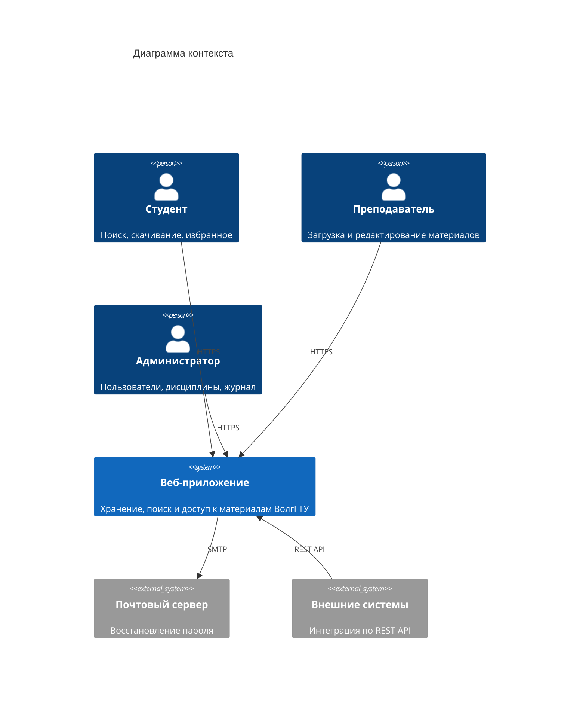
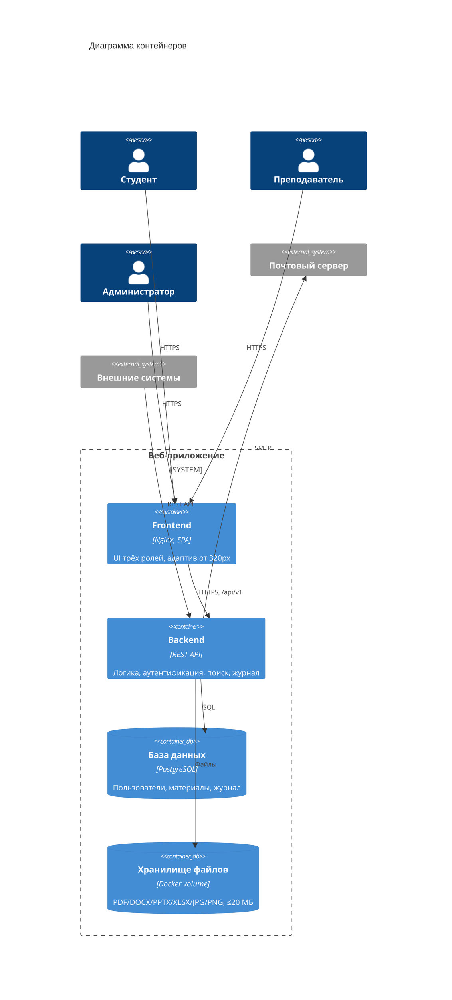
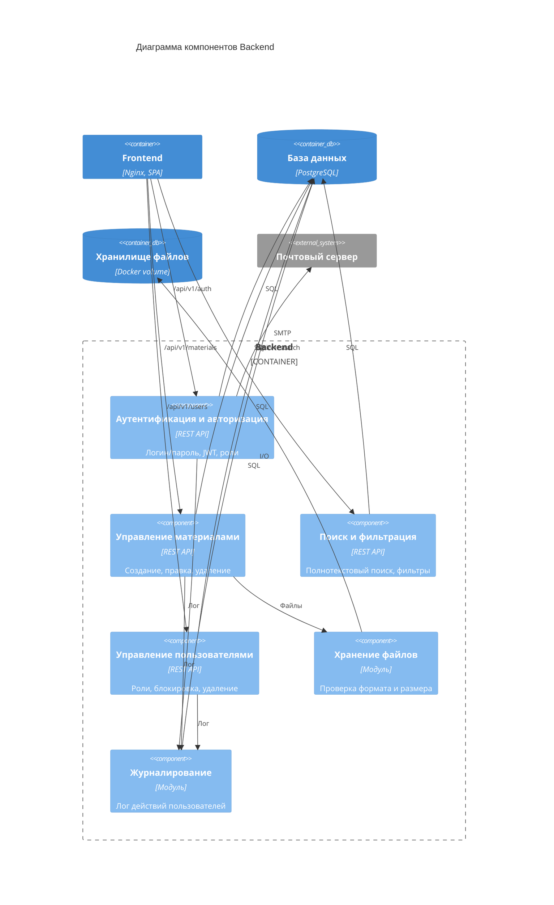
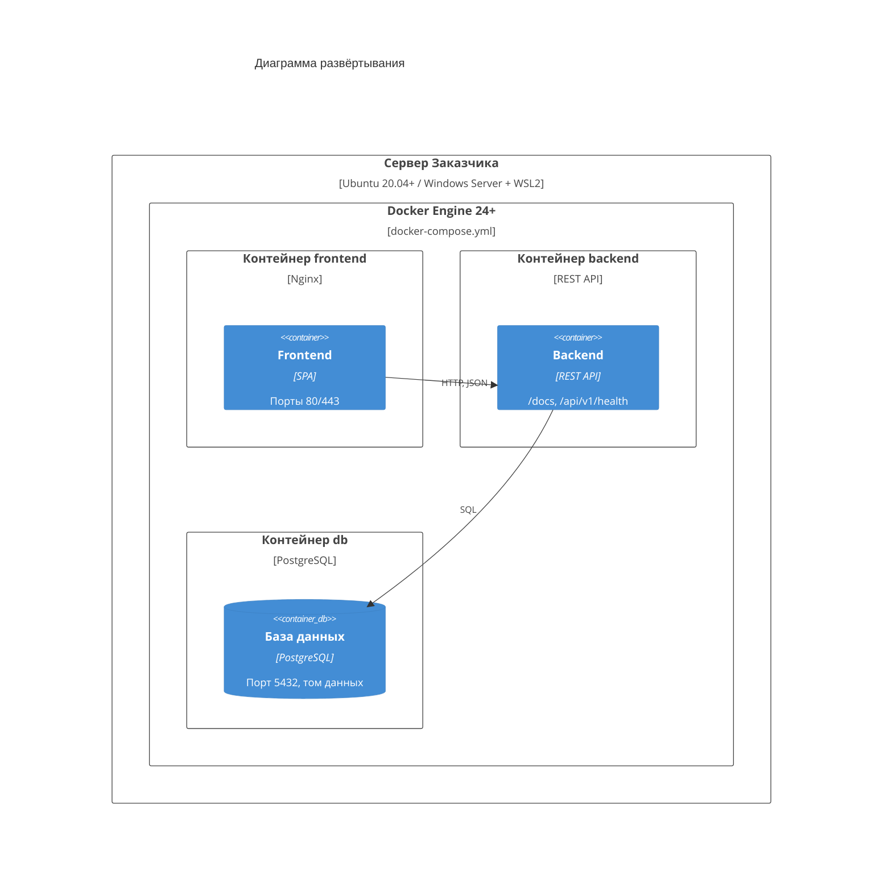

# Архитектура веб-приложения для управления учебными материалами (C4)

## Уровень 1. Контекст системы

Кто и как взаимодействует с веб-приложением (см. раздел 3.1 ТЗ).

## Уровень 2. Контейнеры

Из каких частей состоит веб-приложение (см. раздел 3.2 ТЗ).

## Уровень 3. Компоненты серверной части

Из каких модулей состоит Backend (см. раздел 4.1 ТЗ).

## Развёртывание

Схема запуска через Docker Compose (см. раздел 6 ТЗ).

> Развёртывание выполняется в двух экземплярах: тестовая среда (предварительные испытания) и промышленная среда (опытная эксплуатация).
